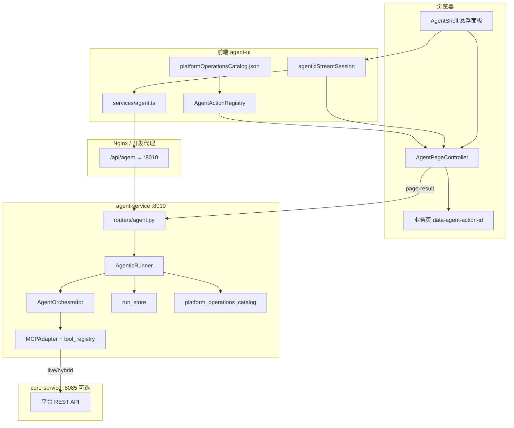

# HAP Agent 架构设计

## 1. 设计目标

HAP Agent 不是「纯聊天机器人」，而是**能操作 HAP 平台 UI 与后端 API 的 Agentic 执行器**：

1. **多轮推理**：LLM 根据用户意图选择工具，读结果后再决定下一步。
2. **双通道能力**：
   - **MCP 工具**：查询/写入平台数据（训练任务、血缘、审计等），经 `core-service` 或 mock 执行。
   - **页面操作（ui_action）**：在浏览器中导航、点击、填表，由前端 DOM 自动化完成。
3. **人机协同**：高风险操作需用户确认；缺参时通过 clarify 条收集补充信息。
4. **可观测**：每次 run 有 `trace_id` / `run_id`，审计、指标、补偿链路可追溯。

## 2. 总体架构



## 3. 核心设计原则

### 3.1 单一执行入口

所有对话式执行走 **`POST /api/agent/run/stream`（SSE）**。无同步「一次性 plan」主路径；plan 能力已收敛进 Agentic 多轮循环。

### 3.2 前后端分离的页面操作

页面操作**不在后端点击 DOM**，而是：

1. 后端发出 SSE `page_action` 事件（含 `ui_action_id`、路由、参数）。
2. 前端 `AgentPageController` 查 `AgentActionRegistry`，定位 `[data-agent-action-id=...]` 并执行。
3. 前端 `POST .../page-result` 把成功/失败回灌给 `run_store`，后端唤醒等待中的 `AgenticRunner` 继续 LLM 轮次。

这样后端可水平扩展，且与 React SPA 路由/权限天然对齐。

### 3.3 Catalog 为页面能力权威源

`catalog/platform_operations_catalog.json`（1302+ `ui_action_id`）定义：

- 模块、页面层级（`parent_ui_action_id`）
- 路由、`action_type`（navigate / click / fill / open_panel 等）
- 风险等级、权限 scope、Agent 描述

同步脚本 `scripts/sync-catalog.sh` 将同一文件复制到：

- `backend/agent-service/data/platform_operations_catalog.json`
- `frontend/.../AgentShell/platformOperationsCatalog.json`

后端据此生成 **`hap_op_{ui_action_id}`** 工具；前端 `AgentActionRegistry` 映射到 DOM selector。

### 3.4 层级化页面工具暴露（Hierarchical Page Selection）

为避免一次性把 1300+ 工具塞进 LLM context：

| 层级 | 含义 | 示例 |
|------|------|------|
| L0 | 页面根（navigate） | 打开「数据治理-数据源」页 |
| L1 | 页内操作 | 点击「新建数据源」 |
| L2 | 面板/步骤 | 抽屉内「保存」 |

`hierarchical_page_selection.py` 根据：

- 用户意图（query / page / mixed）
- 当前 `PageRunState`（已导航到哪一页）
- 身份权限过滤

动态构造本轮可见的 `hap_op_*` 工具子集。

### 3.5 身份与权限

- JWT Bearer 与平台 `core-service` 共用 secret（`AGENT_JWT_SECRET`）。
- `identity_service` 解析 role / permissions。
- `platform_operations_catalog.identity_allows_ui_action` 过滤 ui_action。
- MCP 工具经 `RestrictedExecutor` + `allowed_tools` 白名单。
- 开发环境可 `AGENT_AUTH_DEV_BYPASS=true`（生产禁止）。

### 3.6 执行模式

| `AGENT_PLATFORM_API_MODE` | 行为 |
|---------------------------|------|
| `mock` | MCP / 写操作走 mock，适合 CI |
| `live` | 全部真实调用 core-service |
| `hybrid` | 读真实、写需 confirm + token（默认推荐） |

## 4. 模块边界（Monorepo vs 宿主）

本仓库 **hap-agent** 包含可独立交付的 Agent 模块：

| 包含 | 不包含（宿主职责） |
|------|-------------------|
| agent-service 全量源码 | `app.tsx` 挂载 AgentShellHost |
| AgentShell + agent.ts | Umi `.umirc.ts` 代理 |
| catalog + sync 脚本 | 104+ 业务页 `data-agent-action-id` |
| verify 脚本、deploy 片段 | 完整 Nginx 网关配置 |

详见 [frontend/host/README.md](../frontend/host/README.md)。

## 5. 部署拓扑

```
                    ┌─────────────┐
  用户浏览器 ──────►│ Nginx :8086 │
                    └──────┬──────┘
           /api/agent/*    │    /*
                           ▼
              ┌────────────────────┐
              │ agent-service:8010 │
              └─────────┬──────────┘
                        │ MCP live
                        ▼
              ┌────────────────────┐
              │ core-service:8085  │
              └────────────────────┘
```

- Nginx 需关闭 SSE 缓冲：`proxy_buffering off`、`X-Accel-Buffering: no`（代码已设响应头）。
- 片段见 `deploy/nginx-agent-snippet.conf`；容器见 `deploy/docker-compose.agent.yml`。

## 6. 数据与状态

| 存储 | 路径/机制 | 用途 |
|------|-----------|------|
| 会话 | `session_store`（内存/持久化） | 多轮对话、长期记忆检索 |
| Run 态 | `run_store` | confirm/clarify 等待、page-result 唤醒 |
| 审计 | `audit_store` | trace、工具执行记录 |
| Catalog | JSON 文件 | ui_action 元数据 |

Run 结束后 `run_store.clear_run`；confirm/clarify 有超时（按 risk_level 分级）。

## 7. 可扩展点

1. **新增页面操作**：改 catalog → `sync-catalog.sh` → 业务页加锚点 → Registry override（若 selector 特殊）→ 跑 verify 脚本。
2. **新增 MCP 工具**：`mcp/tools/*.yaml` + registry → `generate_mcp_api_tools.py`（可选）。
3. **换 LLM**：`AGENT_MODEL_PROVIDER=openai_compatible` + base_url / model_name。
4. **宿主换框架**：保留 agent-ui 模块与 SSE 协议即可，见 IMPLEMENTATION.md。
